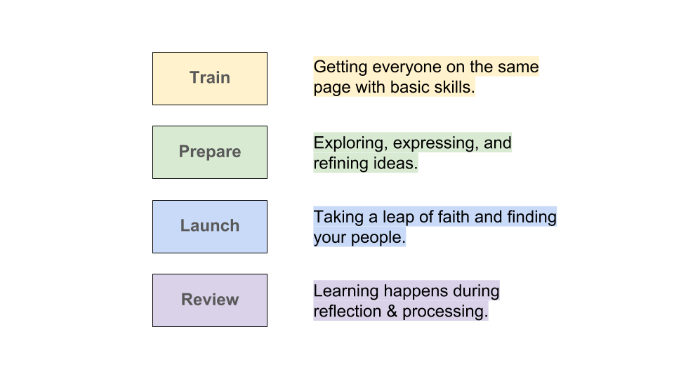
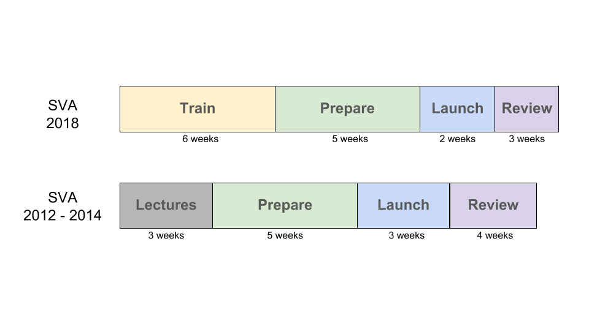
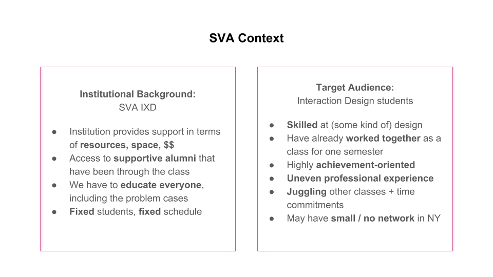
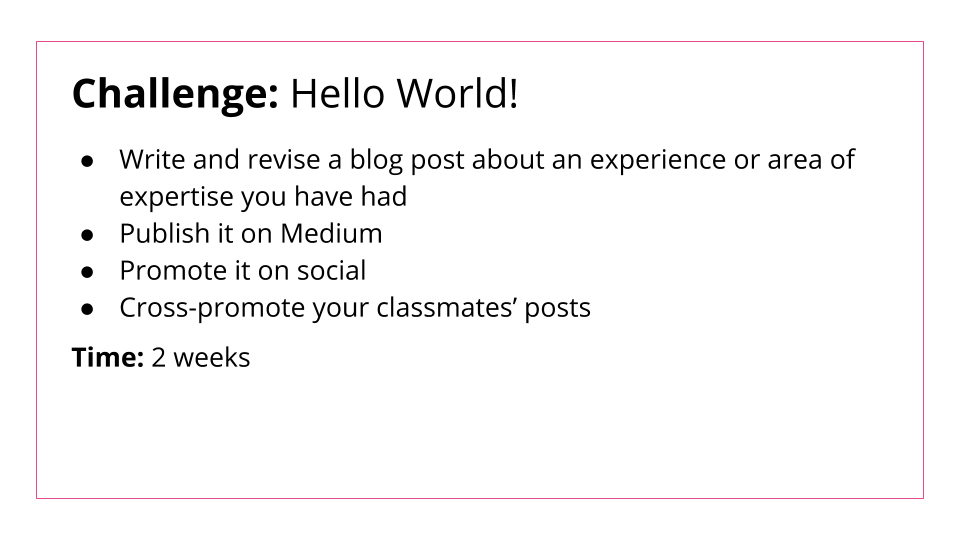
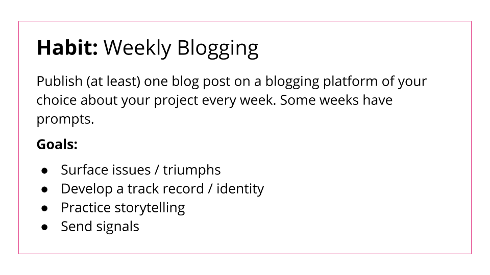
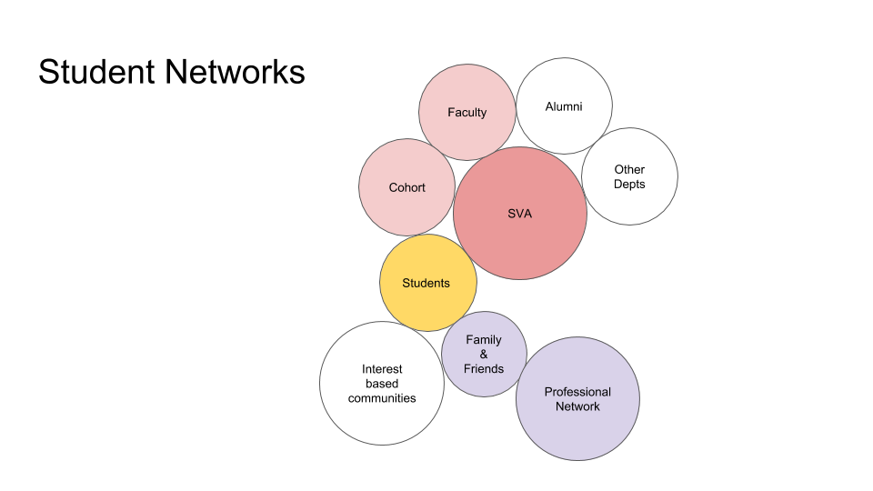
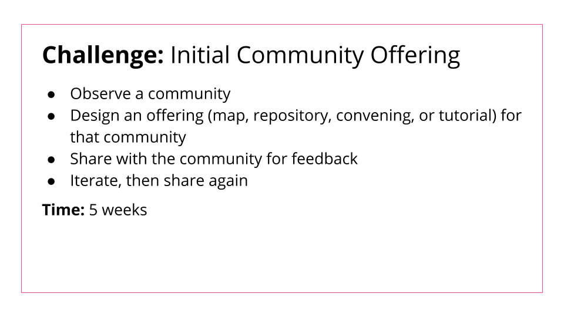
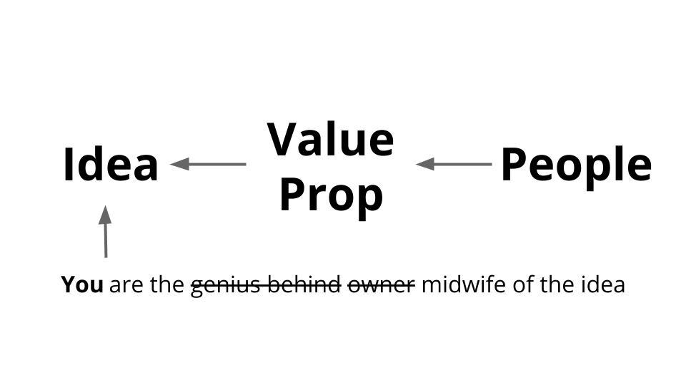
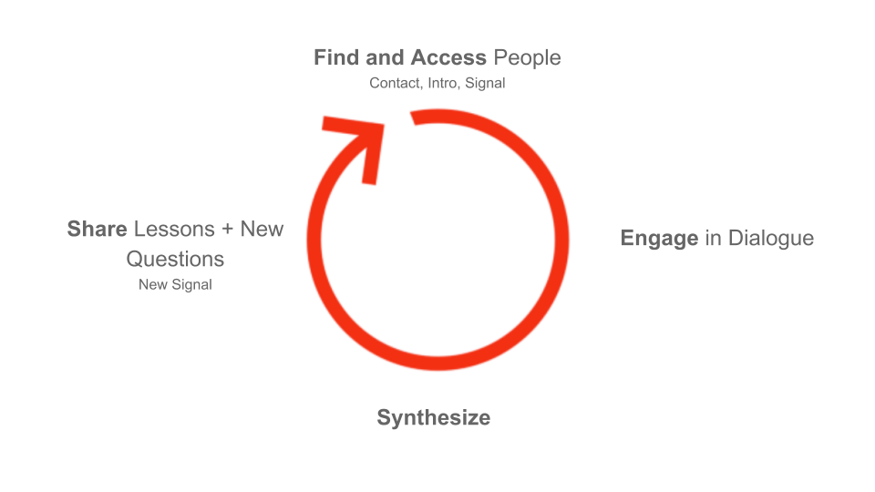
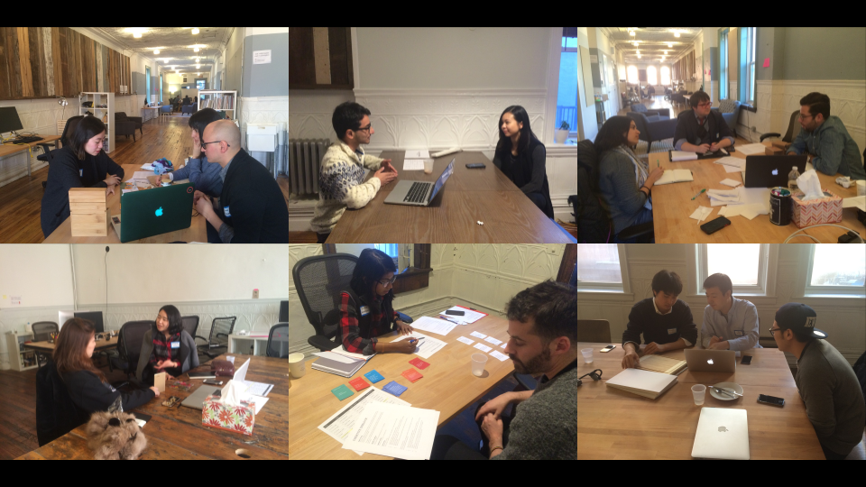

# How We Teach

We’ve learned over the year that it takes a lot of preparation to launch a small payload. If you think about real rocket launch, it takes so much stuff to get this little thing to just break out of gravity. All these other booster rockets and engines actually burn up in the atmosphere but that doesn’t mean it’s not essential. Similarly, the focal point of the class is a 2 week Kickstarter campaign, but we can’t get the students there without doing all this prep work first.

So, our current design of the course is divided into four distinct phases: Train, Prepare, Launch, and Review.

At SVA, we have:

* 16 week semesters

* 15-20 first year Interaction Design MFA students

* Mandatory class

* Fixed schedule (one 3 hour class / week)

* Institutional support in terms of resources, space, $$, and students

And we put together these phases like this:

When we ran it outside the academy, it was a shorter program—4 weeks, 2x a week. We recruited participants who already had a pretty good idea of what they wanted to work on, so we Prepared for only 3 weeks and Launched on the last week. The course did not have time for review.

## Train

In the early years of teaching the class, we didn’t really do much Training because we hadn’t figured out what the students needed. Instead, we did 3 weeks of abstract lectures, and then threw them right into the pool.

From a logistical point of view, getting a student to launch something for the first time is already really challenging. As we’ll talk about later, it’s emotionally and logistically complex for both the student and the instructor.

But as an instructor, you have an additional challenge: getting a whole cohort of students to run through the obstacle on roughly the same schedule and stay in sync with each other. It’s like herding a bunch of scared kittens! We’ve found that the best thing we can do as instructors is to make sure everyone at least starts on the same page with some fundamental concepts and skills by devoting some time to Training.

Training is also helpful for giving students a preview of what they will be experiencing more fully in the later phases of the challenge. Transformative learning requires repeated exposure.

What you need to cover in Train depends on the context in which you are teaching, as well as who your students are.

For our students, we center our Train phase around 3 fundamental skills.

**(1) Being an Explorer:**

To help our students move into an explorer mindset, we structure the Train phase also as a series of challenges (mini-obstacle courses designed to get students practicing fundamental skills while exploring their interests) and habits (tools and practices that help students in the journey ahead).

**(2) Sending Signals:**

We define a signal as a way to share your intention, gather feedback, and identify allies: like a flare you’re sending out into the world to find others curious about the same topic, or a flag planted in the sand to declare your stance.

One way we train them to send signals is the Hello World! Challenge. When we first started teaching, we never thought we had to teach this! But in fact, it’s gotten harder—even though having an online identity is pretty crucial for people’s careers in IXD. We came up with a challenge to make sure they all had at least one published story under their belts.

Blogposts are very common signals. [[ Examples ]] These signals make it easier for people to find you and learn about who you are and what you’re about. You can contact someone and ask for a meeting and instead of sending them a really long email, you can link to a post you wrote about who you are and why.

In fact, the Hello World Challenge is actually also the kickoff for the blogging habit we ask them to maintain throughout the semester. Asking students to blog weekly encourages them to be less precious with their thoughts and work, and to increase surface area for serendipity.

**(3) Understanding Networks:**

Helping students build up a network is critical to success not just in the class, but for our students’ whole careers and lives.

At SVA, we teach a lot of international students who were new to New York and often didn’t have large networks in the city (or even the continent). We realized that this was making a huge difference in how they were able to engage with the rest of the class.

We get the students to start understanding (and building) networks through a challenge we cheekily named Initial Community Offering, in which they have to spend time with a community, then iteratively design an offering that can serve the community’s needs. The ICO challenge familiarizes students with how networks/communities work, how to observe them, and how to give back to them—essential skills if they’re really going to design something with or for the community, rather than making something and throwing it over the wall.

In our opinion, a common affliction with design and entrepreneurship is that people start with an idea, then define the value proposition, and then go hunting for the people who might care about it. It’s counterintuitive to start with people, but we think it’s important to do so. By inverting the typical model, we reframe the exercise of design as one of deriving problems, not inventing them. Along the way, we deconstruct the (damaging and limiting) idea of the creative genius, and introduce the idea of being a midwife of an idea working with a community instead.

[[ Examples? ]]

By the time our students are done with the training phase, they have gone through one of the core iterative loops of our class: make something that serves as a signal, have a conversation, share back what you’ve learned, and have that lead to another conversation.

## Prepare

It is at this point in the course that we officially introduce the $1K Challenge. The wording we use is:

"Design, launch and complete a crowdfunding campaign that benefits a community you’ve worked with over the course of the semester. The campaign should raise at least $1,000 from 50 different backers."

This part of the course is the most treacherous for students and instructors alike. To impose enough structure to push people through to the other side, we think of progress as a series of gates that students move back and forth between.

### Ideate

[[ Ideation picture ]]

It takes real motivation to get through all the obstacles on the journey to launch, so the rest of the challenge goes smoother if students are working on something that they truly care about. We’ve often had to reject people’s ideas b/c it’s clear they were trying to please the teacher or b/c they were trying to pick something that was "easy to do". People aren’t always led to believe that their ideas and interests are worth pursuing.

At this phase, students may know exactly what they want to work on, or they may be asking questions like: "What should I do?" “Is X a good idea?” “Can I do Y?” They may also have no leads at all.

On day one of the Prepare phase, we take the students through a considered ideation process to help them uncover their fledgling ideas. We’ve learned that without a process, people will waste a lot of time wallowing in self-doubt because there wasn’t an immediately obvious idea.  They’re paralyzed. And, if they’re paralyzed, they’re wasting time.

[[ Ideation process ]]

By the end of this process, their thinking is at about the fidelity level of: "I like nudibranchs," “I’m interested in restorative justice,” or “I want to do something around homelessness.” This may feel awkward for students because these don’t feel like answers and they’ve been trained to get to certainty, but it is sufficient for having a direction to move in, and for getting a sense of **who** you’ll need along the way. They’re ready to explore their idea(s).

### Explore

"Explore" connotes an open-ended process, but there needs to be some structure or people will get hopelessly stuck.

Our guiding principle throughout the Explore phase is that we move our ideas forward through dialogue. In some cases, students know exactly who they need to speak to, and may just need some help figuring out how to reach out.

<table>
  <tr>
    <td></td>
    <td>Can Find</td>
    <td>Can’t Find</td>
  </tr>
  <tr>
    <td>Can Access</td>
    <td>Contact
Directly</td>
    <td>Launch a Signal</td>
  </tr>
  <tr>
    <td>Can’t Access</td>
    <td>Get an Intro</td>
    <td>Launch a Signal</td>
  </tr>
</table>

If you can find *and* access the people that you need, you can just reach out to them directly via  email, tweet, call, text. If you can find the people that you need but don’t have direct access, you can figure out how to leverage your network to get an intro.

But if you can’t find the people you need at all, you may need to launch a signal to make it easy for your network to help you.

In the best case scenario, launching a signal starts an iterative process that takes the student from one conversation to the next, enabling them to refine their idea along the way. The student might decide they need to go further, or that their idea isn’t very good, or that they need to switch directions. Sometimes, they might need to go back to the ideation stage if they realize that they’re not all that interested in their idea after all. Even if it may not feel like it to the student, all of this is progress.

The worse, and far more common, scenario is that the student is stuck and not moving at all. Stuck students require help, and that help starts with a reframing: that **stuckness is just a symptom of not having enough information**.

At this point, thinking harder isn’t going to get the students anywhere. Instead, remind them of the process, and repeat until unstuck: what information are they missing? Who is likely to have access to that? What signals can they make that will get them that access? Who can they share this with?

The goal of the Explore phase is to help the students get to a point where they can articulate their direction succinctly. If they can tell us "I want to create [thing] for [community]," they’re ready to move on to the next phase.

### Express

Now that the students can articulate what they’re working towards, what they need is a container for their ideas. This container should prompt them to flesh out the details of their ideas, tease out decisions they’ll need to make, and commit to hard decisions that will shape their project. Ideally, it should also feel like a safe space to iterate on their ideas while they’re fragile and new. Once the ideas are in the container, we can mold, critique, and share them more easily.

As instructors, it’s our job to find the best container for our students and our course—to impose the constraints that they don’t necessarily know they need to help move their ideas along.

There are a lot of containers we could use for this phase (e.g. a slide deck, a business model canvas, an Amazon-style "Working Backwards" press release) but we have found that the Kickstarter project draft actually works perfectly for our purposes. Filling out the Kickstarter project draft requires the student to think through the narrative for their project, the actual resources they will need to make the project happen, and the engagement model for potential supporters. As a bonus, it’s all “real” work that will actually see the light of day when the project launches.

Another benefit of using Kickstarter as the container is that we can take advantage of its large ecosystem: we can draw on past and current projects as examples, and share out guides and post-mortems as teaching materials.

The challenge of this phase is that of pinning a shifting, amorphous set of thoughts and potentials in the student’s brain into a fixed form. It is a time to acknowledge (and then attempt to address) flaws in the idea, to let go of alluring but nonessential parts of the plan, and to face the real risk that other people are not going to understand their intentions. It is a frustrating and sometimes painful part of the journey for many students—confronting the gulf between their ideas and reality will make some of them want to abandon their work and start on something new. It is our responsibility as instructors to help them figure out the difference between a project that genuinely needs to be abandoned due to fatal flaws uncovered at this stage, and those that just need some tenacity to get off the ground.

### Refine

At this stage, the students probably need an editor.

First-time creators have a hard time with scope. For many, it’s natural to dream the biggest thing possible without realizing how much risk or work they’re signing themselves up for. However, at this stage they may also be experiencing decision fatigue—it’s taken a lot of hard choices to just get to this stage, and facing down even more may feel insurmountable.

What they need is a fresh perspective who can help them get out of their own heads, and figure out—and then refine—their starting point.

Because our students are often tired of our opinions by this point, we decided to bring in outside support with an event called Product Sessions, which we schedule about two weeks ahead of launch. It’s a day-long event where we invite our friends spend a Saturday with the students, splitting up so that each student has three back-to-back 45 minute sessions, each with a different advisor.

Though it can be a lot of work to put together, Product Sessions has a few powerful benefits that has made it worth it for us to run year after year:

1. **Motivation.** Presenting to strangers (even if they’re our friends) is intimidating enough that it pushes the students to get something ready for viewing.

2. **Coverage. **Our network has expertise in things we don’t know anything about.

3. **Perspective**. The students need to hear things from other people, even if they’re saying exactly what we’ve been telling them all semester.

4. **Network.** The side benefit of Product Sessions is that the students now have 3 additional people who are invested in their success, who in turn have their own audiences as well.

By talking to 3 different people, each student is likely to hear something really useful that will send them down the right path towards launch. They have two weeks left to iterate and refine based on the feedback.

Product Sessions has gotten easier to put on with practice and tools, but wrangling enough advisors who are willing to volunteer their time on Saturday is still a challenge. If this seems like too much work, just remember that the key thing is making it easy for the students to talk to new, experienced people.

## Launch

Launch is the big moment we’ve all been working up to. In some ways, it’s straightforward: the students hit the button and their projects go live. It’s the most essential part of the course, because nothing else happens if the project isn’t launched. As instructors, we don’t strive for a 100% success rate for the projects, but we do everything in our power to ensure a 100% launch rate each year.

For the students, launching on time is the biggest challenge. It’s a challenge because by this point, they are exhausted and anxious. They are overwhelmed with "what if"s that tempt them to drag their feet and stall however they can:

* What if no one cares?

* What if people hate it?

* What if it’s not ready?

We used to underestimate how hard this really is for students, especially those who have never taken a similar leap before. At the moment of launch, it’s either going to happen or not. It’s too late to address the irrational fears that might derail the process.

What you have to do, instead, is make sure they feel adequately prepared and supported ahead of time. A lot of the process we’ve been describing up until now has been put in place to deal with these anxieties in a systematic way, well before the moment of launch.

This was a big realization—it took us a while to realize that we needed a multi-stage rocket to get them into orbit.

One final thing we do to ensure everyone launches on time is that we launch together, as a class. Everyone hits the button at the beginning of class and then we celebrate with pie.

The second biggest challenge is getting anyone to care. This has gotten *much harder* in 2019, when everyone social media platform is just an unrelenting torrent of breaking news and controversies.

At some level, this is out of their hands already. Did they make something people want, or simply something *they* wanted? Did they talk to the right people? Did they incorporate their feedback? Did they find allies and build credibility? During launch, we find out the answers to these questions together.

What they *can* still do, however, is hustle for attention. We prefer to show them how to do outreach rather than marketing: how you make a signal people want to share, how you ask for help, what success looks like. A huge part of it is normalizing the notion that asking for help is necessary, and not shameful. We can’t expect everyone to know what we’re doing and why; outreach is about taking the step to tell people.

[[ Orbital example? ]]

We help them understand that over the course of the semester, they’ve grown their networks. They have new relationships, and these are people they need to specifically ask to support them

They now have people to reach out to (Allies), and they are credible b/c they’ve been working in public (Challenge #1)

We’ll also get involved and help signal boost:

1. We’ll back each project for $1.

    1. This helps bring our networks to bear without affecting the outcome greatly.

2. We’ll tweet & retweet

The campaigns run for a full two weeks.

(You don’t need more than that for a well-scoped campaign.)

Kickstarter, again, is great because campaigns begin and end on a given day.

They enable an experience of finite duration.

If you asked people to launch an app, or a business, or a website, these things have no beginning and end.

Largely, the campaigns run like you’d expect.

Initial interest, followed by a bit of slog, and then sometimes there’s a bump at the end, and other times there isn’t.

However it isn’t the campaigns or the $ that is interesting so much as it is the context that’s now created with the launch window.

They’re now squarely in the sea of uncertainty, and it can feel terrifying.

This is a really huge step.

The campaigns are launched, there’s no clear "right" thing to do next.

It’s going to be different for everyone.

There are going to be highs, lows, and everything in-between.

This is what it feels like...

Before, we were taking them through a training program.

But, at this point, they are now driving the car.

And they’re in control of what they do.

But they also know they’re not in control of what happens.

They don’t control outcomes—anything can happen.

This is the unique experience we want them to have—the kind that you can’t create through other types of learning models.  

Because there are some lessons that can only be learned through experience.

And because they’re driving, anything the gain from their experience becomes much more meaningful.

[[ Examples:

Amy Ashida getting $2000 from one donor

Upstanding Desk raising $100000 ]]

A huge part of experiencing these lessons is that you develop a better understanding of the nuances.

It leads to developing their intuition because they’re having a lived experience vs. reading a Medium article.

For example:

Understanding that behavior isn’t always rational.  It can’t necessarily be engineered.

Also, understanding what validation feels like.

The idea that getting the proof that what you’re working on something that is meaningful to you and others is integral to continuing on your journey.

Understanding and acknowledging that the environment affects outcomes—we don’t build things in a vacuum.

Understanding your own power in world hyperconnected via networks.

[[ Quotes & Stories ]]

## Review

We are reviewing.
