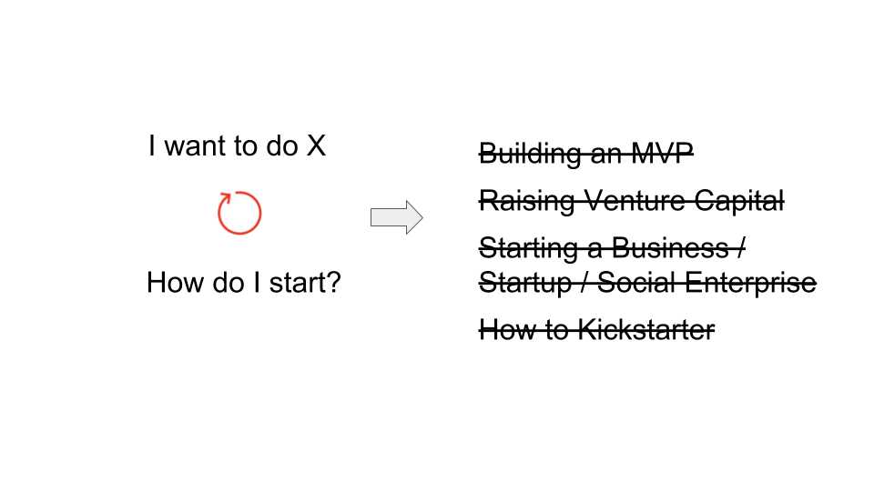
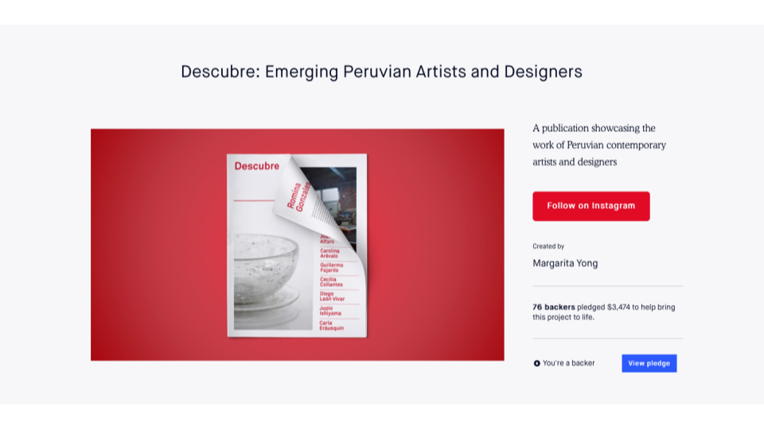

# The Workshop

In May 2018, we wrapped up our 7th iteration of the Entrepreneurial Design course at SVA IxD, and the 10th variation of this experiential learning program. It was our most successful version of the course and so we were trying to figure out what to do next. What should we do with this knowledge that we now have.

We went through a few different iterations—a book, a conference, etc., and decided that we should do what we tell our students to do: Launch a signal out into the world and see what comes back.

We didn’t really know what to expect. However, we were pleasantly surprised. Over 50 people applied, of which only a 2-3 didn’t fit the requirements.

We got exactly what we wanted—which is a group of educators and activators  doing a wide range of work, working within different organizations and communities in different functions, all of whom fit this definition.

### What this is and isn't about

The course we designed turned out not to be about what the tech industry tends to think of as business fundamentals, like how to raise VC or build an MVP, but rather about how to get started when you have an inkling of an idea. Fundamentally, we have been exploring the question: "What enables artists, entrepreneurs, and activists to be successful in today’s networked world?"

After 10 iterations of teaching it, our current best answer to this is: the abilities to **confront and navigate uncertainty**, and to **grow and sustain relevant networks**.

### Teaching through challenges

The best way we have figured out how to teach these two skills is through something we call the $1K Challenge, which we first developed at the School of Visual Arts’ MFA in Interaction Design program. In 2018, we framed the $1K Challenge to our students at SVA as:

> "Design, launch and complete a crowdfunding campaign that benefits a community and raises at least $1,000 from 50 different backers."

### Outcomes

In response to this prompt, our students made things like [[ examples, examples, examples ]].

In the last 7 years, we have taken over 100 people through this program, who have collectively raised more than $340,000 for their ideas.

But it’s not really about the money. Instead, the money is a carrot that lures them through an obstacle course that forces them to learn real, valuable, lessons.

"This class has taught me to have **confidence** in my opinion, curiosity, and (burgeoning) expertise on design."

— Sarah Henry, ‘15

"One of the key things I learned is the** huge gulf between theory and practise**."

— Tony Chu, ‘13

"...I embrace the **possibility of failure** as a learning opportunity..."

— Leroy Tellez, ‘15

"I’ve learned that **we are worthy of other people’s support**..."

— Song Lee, ‘17
